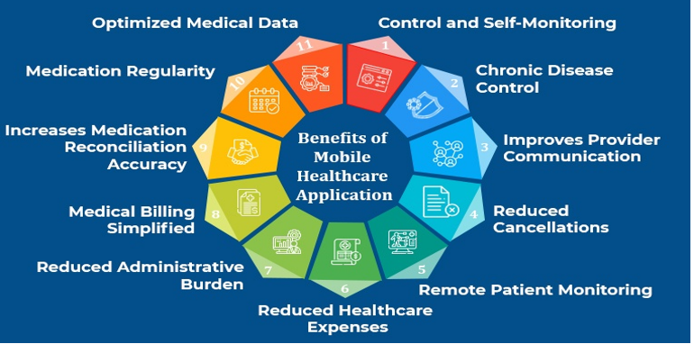

# Mobile Health:

## What is Mobile Health?

Mobile health is a rapidly growing area of digital health which involves providing health care support, delivery and intervention through mobile technologies such as smart phones, tablets and wearables. Basically, it describes the use of mobile phones and wireless technology in medical care.

## Development of Mobile Health through years:

Due to rising healthcare costs, m-health has become more and more important. In the past few years, mobile health apps have undergone a significant amount of development and evolution. In the healthcare industry, mobile apps have gained a tremendous traction and a great momentum in the last few years.A mobile health app is nothing short of a necessity given the steadily growing number of individuals utilizing mobile devices. Within the current pandemic, the benefits of virtual care have been realized like never before. It is possible for patient and doctor to communicate without needing to be in the same location. The full conventional treatment pathway can be employed with mobile health solutions. They can be used in the wellness, prevention, diagnostic, therapy or control phase.The advancement of medical technology is frequently accompanied by an increase in costs.

## Advantages of mHealth in medical field:

mHealth operates differently since it usually makes use of already-existing technology, such mobile Internet. As a result, mHealth can improve patient care while also significantly reducing healthcare expenditures, especially for the people who are found in rural places. Adding to that,Doctors and healthcare professionals can exchange information about diagnoses and treatments and develop an optimal treatment plan. This could cut down on wasted consultation time, decrease the hassle of missed appointments, and save time.Also, Patients can communicate with their doctor or the appropriate institution as frequently as they like about their health-related parameters,this enables both, more cost-effective personnel planning and cost savings.

## Usage of health applications:

The addition of remote monitoring and counseling can also lead to more effective management of chronic illnesses. This reduces treatment costs and can be done quickly and easily from the patient's home.The outpatient industry can gain from mHealth as well. In larger practices with multiple consulting rooms, patient data, including all necessary information, can be conveniently accessed from a mobile device. Medication and prescribed therapies can be recorded and structured.The efficiency of internal processes, recording, and administrative tasks increases as a result. Also,mobile health services give the patient the opportunity to better deal with their own illness.By doing this, a health care system is created that not only prioritizes the patient but also includes them and empowers them to take charge of their own health.Through self-motivation apps, patients can take control of their treatment in a targeted way. When therapy outcomes are reached, such as weight loss in patients with chronic heart failure, motivational incentives may be offered. The patient may use applications on his individual treatment path,effectively manage it and suggest improved coordination with the involved service providers. Adherence to therapy and compliance are also improved. Additionally,in developing nations with limited access to hospitals and medical facilities, remote monitoring creates new treatment options for patients and dramatically raises survival rates. Another major advantage mobile health apps offer is health literacy. Obviously, most patients typically don't know their diagnoses or treatment options. For this, they are entirely reliant on caregivers. But by giving patients all the necessary health information, mobile health applications can guarantee patients' health literacy. Moreover, mHealth appscan give patients preventive care because patients can easily monitor their vital signs and behavior. This can be particularly helpful for patients with chronic conditions. Besides, wellness apps that encourage users to maintain healthy lifestyles are a quickly developing trend in mobile health management.Through the mobile health system, fitness, lifestyle, and nutritional aspects of health are tracked.Health goals are established and aspired toward as more patients adopt wellness practices like working out, tracking their activities, and monitoring their diets.Most of the time, wearable technology is where these mobile health app developments are used.It permits customers to shop and use cellular fitness statistics for significant analysis. 

One of the newest and most popular trends in healthcare is medical is the chatbots.Even though, this technology is designed to aid healthcare professionals, including it in mobile health apps can increase its effectivity for everyone, including patients. Through medical chatbots, patients can be reminded to take medicines. They can even make drug references to help patients with specific drugs. In addition, connecting mobile health technology with artificial intelligence can solve several problems. Moreover, AIcan alsoefficiently manage a lot of data rapidly to extract useful ideas that can help in clinical decision-making. Thus, AI-powered mobile health apps can enhance care diagnosis and outcomes because they are much faster, more precise, and less expensive.

## Challenges facing mHealth:

As mobile health apps generate large amounts of data, the risk of cyber-attacks is also high. Well, security breaches and cyber-attacks are known to impact the financial stability of healthcare organizations.Therefore, security is a concern for those who develop and provide mobile health technology.Focusing on its security is another important trend, in addition to new developments in the mHealth technology field. It's crucial to make sure that mhealth apps are secured and safe from bugs and malware. Correspondingly, this ensures the security of critical health information.The widespread adoption of mHealth is limited by various a of obstacles, including low literacy, poor infrastructure, a lack of skilled professionals, and cultural issues, despite the promising opportunities that it offers in developing nations.For the successful performance of mHealth initiatives, these challenges need to be addressed to provide the necessary health services–that are well-matched with the existing healthcare systems.

## Conclusion:

But as demand rises, mHealth apps are given the ability to provide a wide range of services never before possible. The dangers and reservations associated with using these apps have been reduced by improved security and regulatory compliance. Continued research and trials should be completed to improve upon issues being encountered and to find ways to better serve stakeholders. To sum it up in a nutshell, healthcare organizations must get on the mHealth trend to be able to stay ahead of the curve and address the contemporary demands of our age.

## References:

-[https://www.osplabs.com/insights/what-is-mhealth/](https://www.osplabs.com/insights/what-is-mhealth/)

-Bloss CS, Wineinger NE, Peters M, Boeldt DL, Ariniello L, Kim JY; et al. (2016). ["A prospective randomized trial examining health care utilization in individuals using multiple smartphone-enabled biosensors"](https://www.ncbi.nlm.nih.gov/entrez/eutils/elink.fcgi?dbfrom=pubmed&tool=sumsearch.org/cite&retmode=ref&cmd=prlinks&id=26788432). _PeerJ_.  **4** : e1554. [doi](https://www.wikidoc.org/index.php/Digital_object_identifier):[10.7717/peerj.1554](https://doi.org/10.7717%2Fpeerj.1554). [PMC](https://www.wikidoc.org/index.php/PubMed_Central) [4715435](https://www.ncbi.nlm.nih.gov/pmc/articles/PMC4715435). [PMID](https://www.wikidoc.org/index.php?title=PubMed_Identifier&action=edit&redlink=1) [26788432](https://www.ncbi.nlm.nih.gov/pubmed/26788432).

-[https://2muchcoffee.com/blog/mobile-health-mhealth-market-analysis-and-forecast/](https://2muchcoffee.com/blog/mobile-health-mhealth-market-analysis-and-forecast/)

-[https://www.nature.com/articles/s41586-019-0956-2](https://www.nature.com/articles/s41586-019-0956-2)

-[https://www.rishabhsoft.com/blog/benefits-of-mobile-apps-in-healthcare](https://www.rishabhsoft.com/blog/benefits-of-mobile-apps-in-healthcare)
